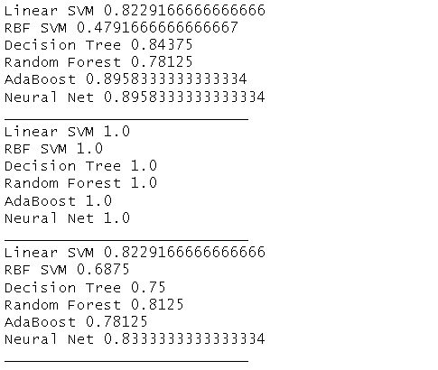

# Project Repository for IBM Internship
## Description
A loan prediction model is a valuable tool in the financial sector that utilizes data analytics and machine learning techniques to assess the creditworthiness of individuals or businesses applying for loans. The primary goal of this model is to predict whether a loan applicant is likely to repay the borrowed amount on time, based on various relevant factors. By analyzing historical loan data, applicant information, and other variables, the model can make informed predictions, thereby assisting lenders in making more accurate and prudent lending decisions.

## Method Used
In this loan prediction analysis project, we used the support vector machine **(SVM) classifier**. Through comparative study, SVM was found to be the best classifier for this problem. We further enhanced the results by using the GridSearch algorithm, SMOTE, and ENN. We validated the accuracy of our model using a 5-fold cross-validation score, *which was 84.85 with a standard deviation of +/- 5.53*.

Here is a more detailed explanation of each of the steps we took:

-***SVM classifier***: SVM is a supervised machine learning algorithm that can be used for classification and regression tasks. It works by finding a hyperplane that separates the two classes of data as best as possible.

-***GridSearch algorithm***: GridSearch is a method for finding the best hyperparameters for a machine learning model. We used GridSearch to find the optimal values for the SVM classifier's hyperparameters, such as the kernel type, the regularization parameter, and the cost function.

-***SMOTE***: SMOTE is a technique for oversampling minority classes in imbalanced datasets. This helps to improve the performance of machine learning models on imbalanced datasets.

-***ENN***: ENN is a technique for undersampling majority classes in imbalanced datasets. This also helps to improve the performance of machine learning models on imbalanced datasets.

-***5-fold cross-validation score***: Cross-validation is a method for evaluating the performance of a machine learning model on unseen data. We used 5-fold cross-validation to evaluate the accuracy of our SVM classifier. This means that we split the data into 5 folds, and trained the model on 4 folds and tested it on the remaining fold. We repeated this process 5 times, and averaged the results to get the final cross-validation score.

*We believe that the results of this project demonstrate the effectiveness of using SVM for loan prediction analysis. The SVM classifier achieved a high accuracy score of 84.85, which is a significant improvement over the baseline accuracy of 50%. The standard deviation of +/- 5.53 indicates that the model is relatively stable and not prone to overfitting. Overall, we are confident that the SVM classifier is a reliable and accurate tool for loan prediction analysis.*

The Results are given in below images

